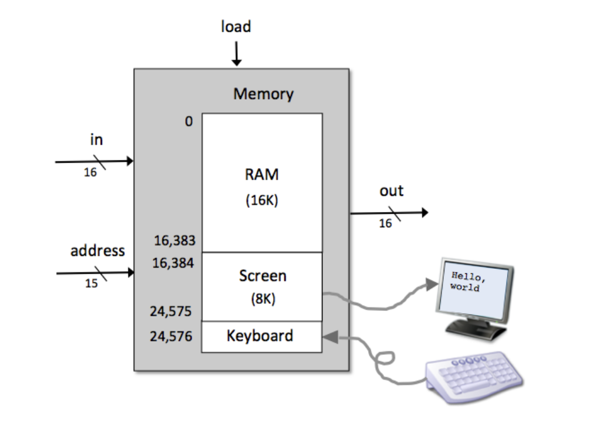

# Implementing Hack Computer
[Book Chapter 5 Computer Architecture](https://www.nand2tetris.org/_files/ugd/44046b_552ed0898d5d491aabafd8a768a87c6f.pdf)  

Building a Hack Computer (Memory CPU and overall computer) which is capable of running Hack Machine language instructions.

## Memory Chip

### API
If load = 0 > output data at given memory.  
If load = 1 at time t-1 > load input at given memory and output at time t.  
- First 16K (16384 registers) are RAM16K chip
- Next 8K (8192 registers) is the screen which is the same as a RAM8K with an additional side effect that each bit of the 8192 registers writes a black/white pixel on the 512x256 pixel screen.  
- Screen memory map: Pixel[row, col] maps to col%16 bit of Screen[row*32 + col/16]
- Next single register is the Keyboard chip which reflects 0 if no key iis pressed or character code in binary of the key currently pressed.

### Implementation
[Memory.hdl](./Memory.hdl)