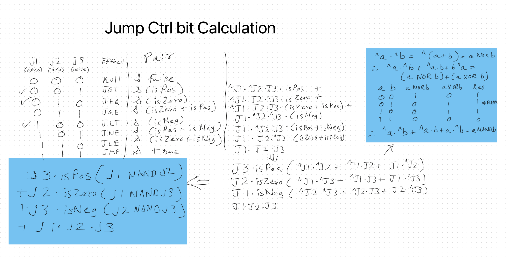

# Implementing Hack Computer
[Book Chapter 5 Computer Architecture](https://www.nand2tetris.org/_files/ugd/44046b_552ed0898d5d491aabafd8a768a87c6f.pdf)  

Building a Hack Computer (Memory, CPU and overall computer) which is capable of running Hack Machine language instructions.

## Memory Chip


### API
The complete address space of the Hack computer's data memory, including RAM and memory-mapped I/O. Facilitates read and write operations, as follows:  
- Read: out(t) = Mem[address(t)](t)  
- Write: if load(t) then Mem[address(t)](t+1) = in(t)  

In words: the chip always outputs the value stored at the memory location specified by address.  

If load==1, the in value is loaded into the register specified by address. This value becomes available through the out output from the next time step onward.  

The memory access rules are as follows:  
Only the top 16K+8K+1 words of the address space are used.  
- 0x0000-0x5FFF: accessing an address in this range results in accessing the RAM.
- 0x4000-0x5FFF: accessing an address in this range results in accessing the Screen.
- 0x6000: accessing this address results in accessing the Keyboard.
- > 0x6000: accessing an address in this range is invalid.  

```
CHIP Memory
IN in[16], load, address[15];
OUT out[16];
```

Notes:  
- First 16K (16384 registers) are RAM16K chip
- Next 8K (8192 registers) is the screen which is the same as a RAM8K with an additional side effect that each bit of the 8192 registers writes a black/white pixel on the 512x256 pixel screen.  
- Screen memory map: Pixel[row, col] maps to col%16 bit of Screen[row*32 + col/16]
- Next single register is the Keyboard chip which reflects 0 if no key is pressed or character code in binary of the key currently pressed.  

### Implementation
[Memory.hdl](./Memory.hdl)  

## CPU Chip
  

### API
The Hack Central Processing Unit consists of an ALU, two registers named A and D, and a program counter named PC (these internal chip-parts are not shown in the diagram). The inM input and outM output hold the values referred to as “M” in the Hack instruction syntax. The addressMoutput holds the memory address to which outM should be written.  

The CPU is designed to fetch and execute instructions written in the Hack machine language. If instruction is an A-instruction, the CPU loads the 16-bit constant that the instruction represents into the A register. If instruction is a C-instruction, then (i) the CPU causes the ALU to perform the computation specified by the instruction, and (ii) the CPU causes this value to be stored in the subset of {A,D,M} registers specified by the instruction. If one of these registers is M, the CPU asserts the writeM control bit output (when writeM is 0, any value may appear in outM).  

When the reset input is 0, the CPU uses the ALU output and the jump directive specified by the instruction to compute the address of the next instruction, and emits this address to the pc output. If the reset input is 1, the CPU sets pc to 0.  

The outM and writeM outputs are combinational, and are affected instantaneously by the instruction’s execution. The addressM and pc outputs are clocked: although they are affected by the instruction’s execution, they commit to their new values only in the next time step.  

```
CHIP CPU  
IN  
instruction[16], // Instruction to execute.  
inM[16], // Value of Mem[A], the instruction’s M input  
reset; // Signals whether to continue executing the current program  
// (reset==1) or restart the current program (reset==0).  
OUT  
outM[16], // Value to write to Mem[addressM], the instruction’s M output  
addressM[15], // In which address to write?  
writeM, // Write to the Memory?  
pc[15]; // address of next instruction  
```

### Implementation
[CPU.hdl](./CPU.hdl)

#### CPU Jump Bit calculation


## Computer Chip
  

### API
The HACK computer, consisting of CPU, ROM and Memory parts.
Memory also has the side effect which can influence the screen and keyboard.   
When reset==0, the program stored in the computer's ROM executes.  
When reset==1, the execution of the program restarts.  
Thus, to start a program's execution, the reset input must be pushed "up" (signaling 1) and "down" (signaling 0).  
From this point onward, the user is at the mercy of the software. In
particular, depending on the program's code, the screen may show some
output, and the user may be able to interact with the computer via the
keyboard.  
```
CHIP Computer  
IN reset;  
```

### Implementation
[Computer.hdl](./Computer.hdl)