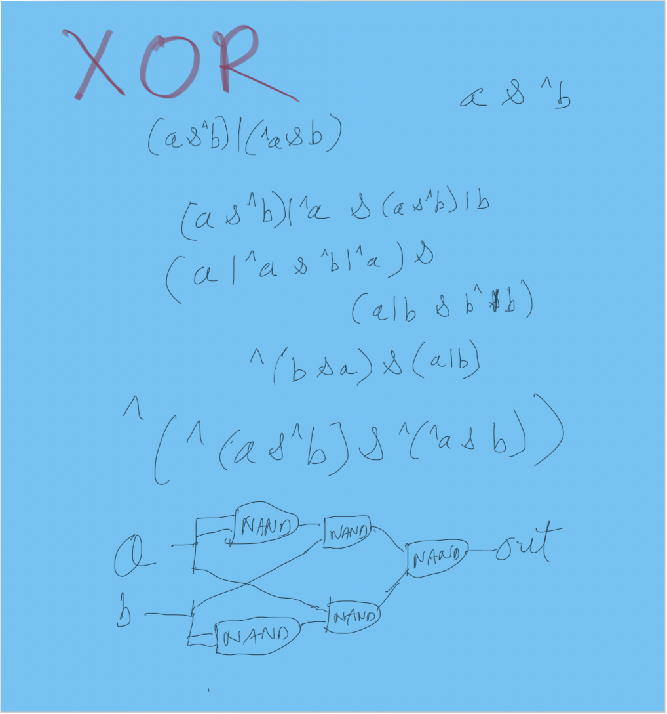
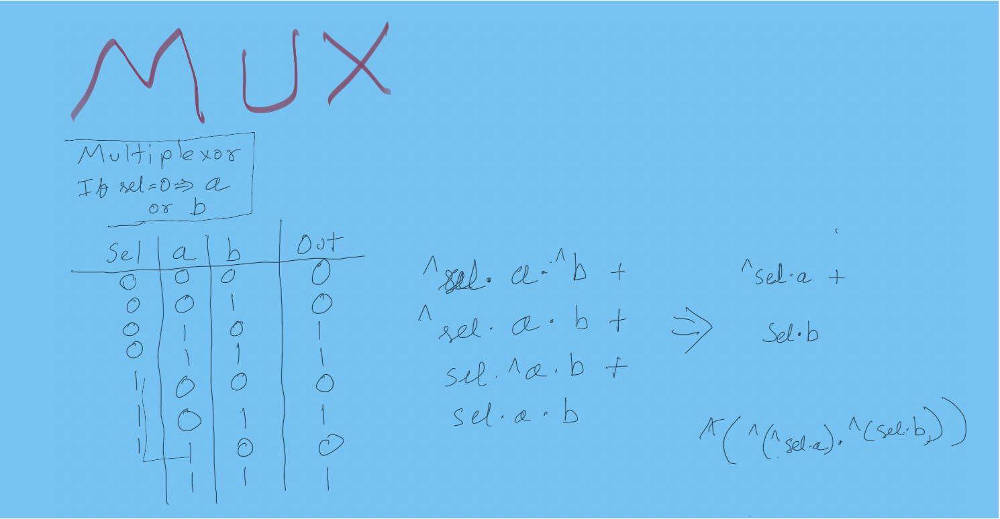
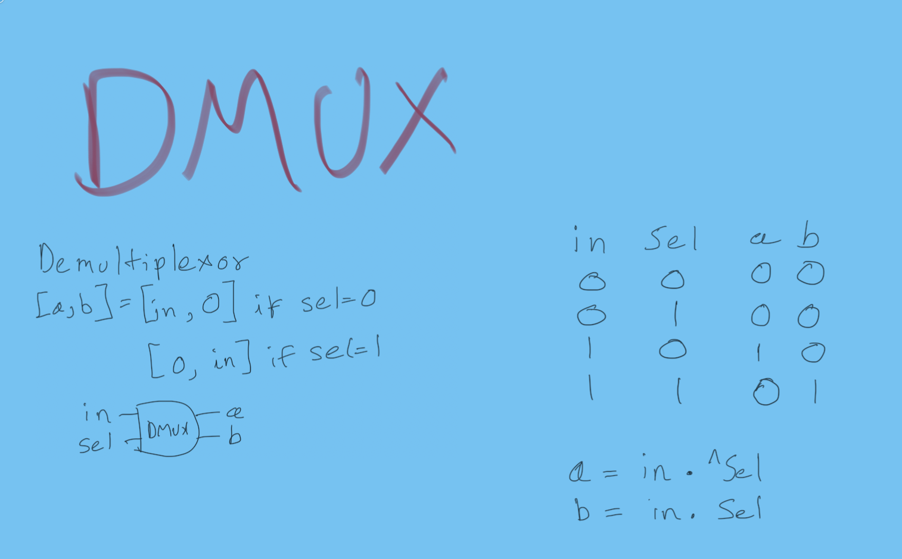
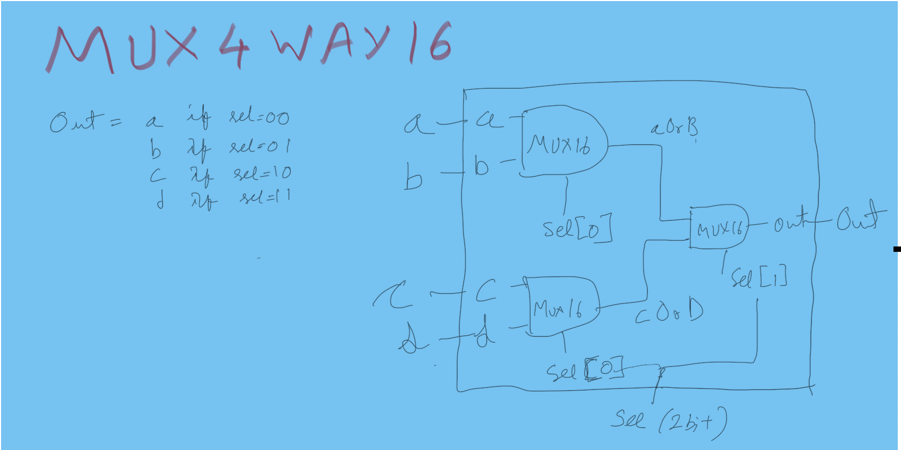
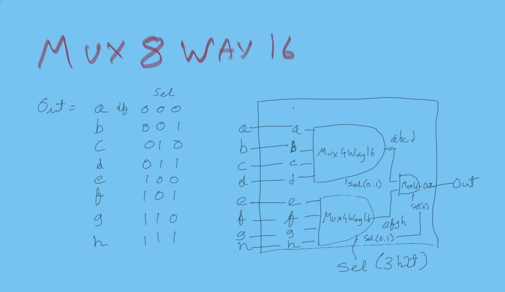
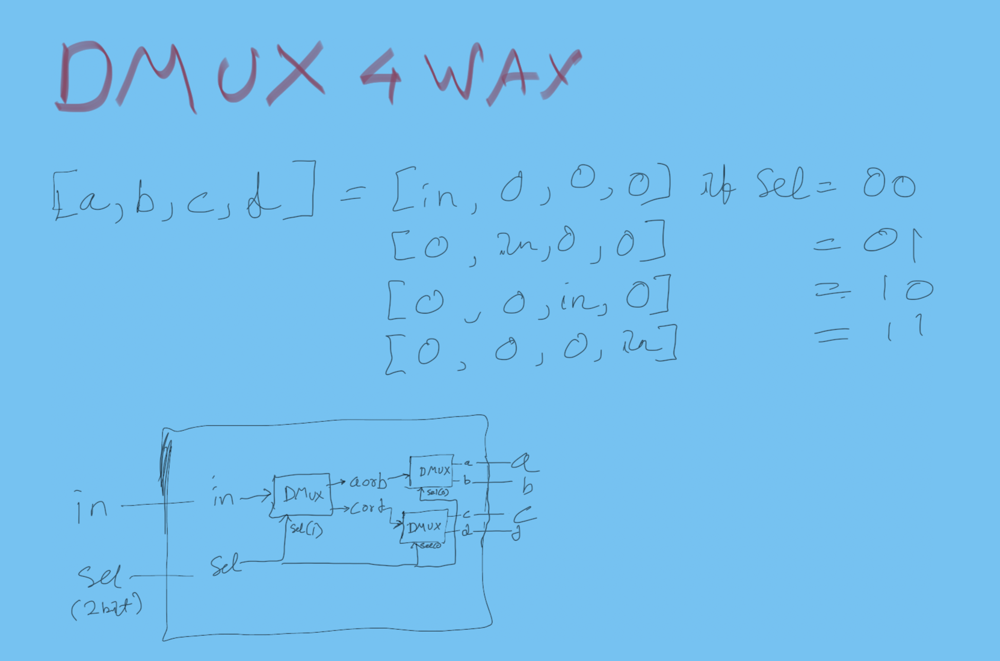

# Elementary Logic Gates

## XOR

## Multiplexor (MUX)

## Demultiplexor (DMUX)

## MUX4Way16 - (MUX with 4 inputs, 16 bits each, 2 bit selection)

## MUX8Way16 - (MUX with 8 inputs, 16 bits each, 3 bit selection)

## DMUX4Way - (DMUX with 4 outputs, 2 bit selection)

